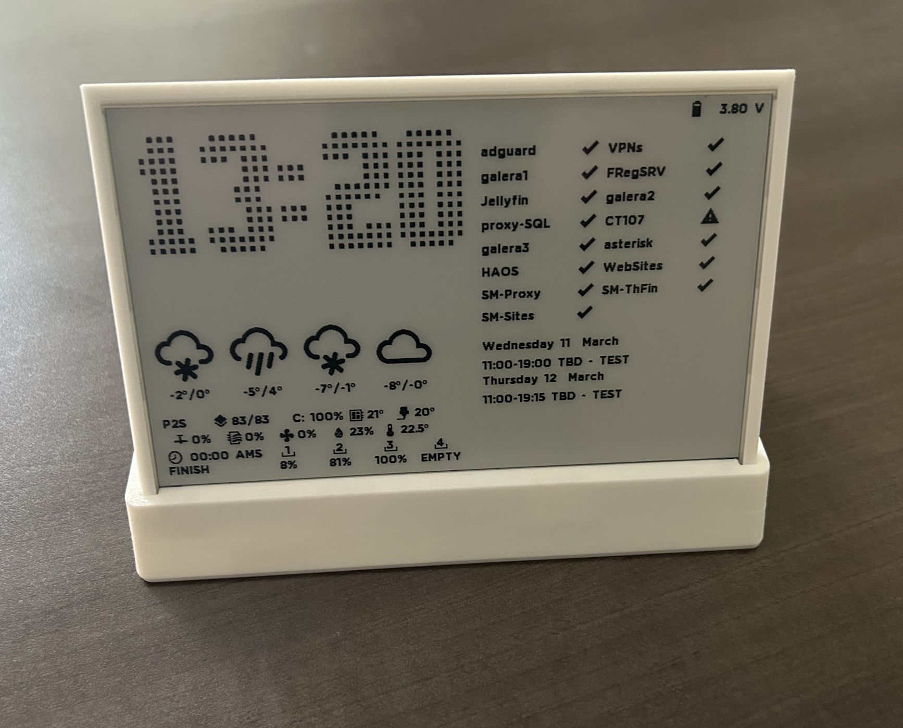

# 🖥️ ESP32 E-Paper Desk Dashboard

A sleek and customizable **desk dashboard** powered by an **ESP32** and a **7.5" ePaper display**.  
This project is fully functional and includes several demo widgets to showcase its capabilities.

🚀 **Contributions are welcome!** Add new widgets, improve existing ones, or fork the project.

---

## ✨ Features

### 📊 Built-in Widgets

- 🖨️ **BambuLab printer monitor**
- 📊 **Makerworld statistics**
- 🖥️ **Proxmox server monitor**
- 🕒 **Time & date display**
- 🌦️ **Weather forecast**
- 📅 **Google Calendar events**
- 📈 **Stock tracking**
- ⛟ **Parcel tracking**
- 📡 **ZigBee** (Testing)

### ⚙️ System Features

- 🔄 **Partial refresh support**  
  Minimizes full-screen redraws for smoother updates (With BW epaper)

- ⏱️ **Configurable refresh intervals**  
  Each widget can update independently  
  > ⚠️ Higher refresh frequency may increase battery usage

- Configure the widget size and position remotelly

---

## 🧰 Hardware Requirements

- ESP32 microcontrolleri  (I used Lolin D32 in the past for the low consumption, now DFRobot FireBeetle 2 ESP32 C6 for option zigbee))
- 7.5" ePaper display *(GxEPD2-compatible)*  
- Battery *(optional)*  
- Ikea switch (Zigbee, Used to turn on the air filter system automatically) *(optional)*

> ⚠️ **Important Notes**
> - Most **color ePaper displays do NOT support partial refresh**
> - Some displays may require **20+ seconds for full refresh**

---

## ⚙️ Setup Guide

### 1. Configure the PIN OUT 

In the configure.h configure the PIN used to control the display, you will find my preference. If you are using a different display that what I used check the GxEPD2 library and configure it in the INO file.

For the 2 files that I precompiled the ESP32 and ESP32-C6 and for the BW 7.5 display, you can find them in https://github.com/VoIPshare/ESP32-eInk-Dashboard/releases, pick the file that is marked a merge, and use this site https://www.espboards.dev/tools/program/ with chrome or edge, remember to set the address to 0x0000  

| Board    | EPD_CS | EPD_DC | EPD_RST | EPD_BUSY | EPD_SCK | EPD_MOSI | PIN_DISPLAYPOWER | BAT_PIN | DEMO_BUTTON |
|----------|--------|--------|---------|----------|---------|----------|------------------|---------|-------------|
| ESP32C6  | 1      | 8      | 14      | 7        | 23      | 22       | 4                | 0       | 2           |
| ESP32    | 15     | 27     | 26      | 25       | 13      | 14       | 4                | 35      | —           |

When you boot for the first time after having uploaded the FW, you must connect to the wifi (Dashbboard-Setup) and configure https://192.168.4.1
Add:
- Wi-Fi credentials
- Google script ID
- MQTT Information (Pass, Serial Number, IP and port)

These values are saved on the device.

This configuration will be reset everytime you upload a new image, if you choose so.

---

### 2. 🔤 Fonts

All font-related setup has been moved to a dedicated documentation file:

👉 [`fonts/README.md`](fonts/README.md)

Inside you'll find:
- Conversion scripts (`ListFontConvertV4.py`)
- Glyph sets for each font
- Icon font configuration (MDI)
- Optimization tips for ePaper rendering

> ⚠️ Glyph order **must remain consistent** or rendering issues may occur.

---

## ☁️ Google Script 
Create a google script for retrive part of the informaiton

A Google Apps Script is used to centralize data:

### Supported Data

- ⛟ Parcel tracking ( https://pkge.net/, you need to register to get the freep API trial ) 
- 📅 Calendar events  
- 📈 Stocks  
- 🧩 Layout configuration 
- 🖥️ Proxmox 

---

### 🛠️ Deployment Steps

1. Create a new Apps Script project  
2. Add your script  
3. Click **Deploy → New Deployment → Web App** and note the published URL. It looks like  
   `https://script.google.com/macros/s/<SCRIPT_ID>/exec` — the `<SCRIPT_ID>` segment is what the firmware expects.

**On the device (no recompile):** After flashing, connect to the setup Wi‑Fi and open the configuration page (see **Setup Guide** above). Enter that **Google Script ID** together with your Wi‑Fi and MQTT settings. You can change it later from the same portal without rebuilding firmware.

---

### 📊 Required Google Spreadsheet

Create a spreadsheet with **3 sheets**: 📈 Stocks, 📦 Tracking 🧩 Layout
You will find a csv for each of the fields with a sample data
---

#### 🕒 Clock Widget
In extra1 field of the clock row in the layout sheet, the string is a POSIX time zone definition used to describe how a clock should handle standard time + daylight saving time (DST) automatically.
EST5EDT,M3.2.0/2:00:00,M11.1.0/2:00:00

---

#### 🌦️ Weather (Open-Meteo)

- Extra1: Latitude (e.g. 40.712)  
- Extra2: Longitude (e.g. -74.006)  

---

## 🧱 3D-Printed Case

Download the custom enclosure:

👉 https://makerworld.com/en/models/2443888-epaper-dashboard-7-5-with-esp32-desktop-version

---

## 🪪 Fonts & Licenses

### Material Design Icons
- Source: https://materialdesignicons.com/  
- License: Apache 2.0  

### Montserrat
- Source: https://fonts.google.com/specimen/Montserrat  
- License: SIL Open Font License 1.1  

### HighSpeed
- Source: https://www.dafont.com/high-speed.font  
- License: Free for personal use *(commercial requires permission)*  

---

## 🤝 Contributing

Contributions are welcome!

- Add new widgets  
- Improve performance  
- Enhance UI/UX  
- Fix bugs  

👉 Fork the repo and submit a PR

---

## ⭐ Final Notes

- Glyph order is **critical** for font rendering  
- Optimize refresh intervals for battery usage  
- Prefer partial refresh where supported  

---

Enjoy building your **ESP32 E-Paper Dashboard**! 🚀
